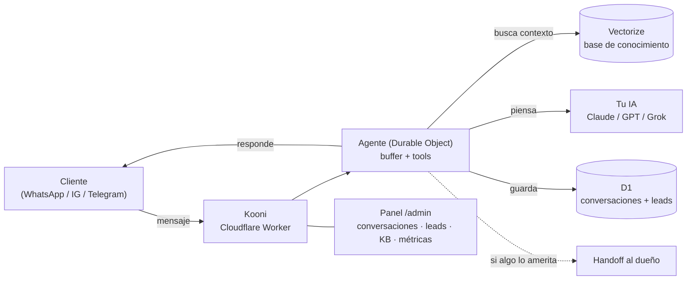

<div align="center">

# 🟢 Kooni

### Tu chatbot de IA para WhatsApp, Instagram, Messenger y Telegram — en **tu propia nube**.

**Atiende a tus clientes 24/7, responde desde tu base de conocimiento, y te avisa a ti cuando algo lo amerita.** Vive en tu cuenta de Cloudflare, con tu llave de IA. Tus datos son tuyos.

<em>Self-hosted AI support bot for small businesses. Lives in **your** Cloudflare, uses **your** AI key. Spanish-first. Deploy in minutes.</em>

[](./LICENSE)
[](https://workers.cloudflare.com/)

[**Instalar**](#-instalar-en-~15-minutos) · [**Cómo funciona**](#-cómo-funciona) · [**Documentación**](docs/)

</div>

---

> **Proyecto de uso interno.** Kooni es un asistente de IA multicanal self-hosted.
>
> Guía de marca: [`docs/IDENTIDAD-KOONI.md`](docs/IDENTIDAD-KOONI.md) ·
> Arquitectura: [`docs/ARQUITECTURA.md`](docs/ARQUITECTURA.md) ·
> Despliegue: [`docs/DESPLIEGUE.md`](docs/DESPLIEGUE.md)

---

## ¿Qué es Kooni?

Un asistente de soporte con IA que montas **en tu propia infraestructura de Cloudflare**
en una tarde — sin saber programar. Vive en tu cuenta, con tu llave de IA, y
**todo es tuyo**.

- 💬 **Multicanal** — WhatsApp, Instagram, Messenger y Telegram desde un mismo cerebro.
- 📚 **Aprende de tus documentos** — subes tus FAQ, políticas y guías; el bot busca ahí antes de responder (RAG con base vectorial).
- 🎙️ **Entiende notas de voz** — transcribe los audios de tus clientes automáticamente.
- 🙋 **Sabe cuándo pedir ayuda** — si algo es delicado o no está seguro, te hace *handoff* a ti.
- 📊 **Panel de administración** — conversaciones, leads, base de conocimiento y métricas, todo en `/admin`.
- ☁️ **Vive en tu Cloudflare** — rápido, barato y sin servidores que mantener.
- 🧠 **Tu cerebro, tu llave** — Claude, ChatGPT o Grok; tú eliges y pagas solo lo que piensa.

---

## 🚀 Instalar en ~15 minutos

**La forma más rápida (con el CLI):**

```bash
npx kooni-bot init
```

Descarga el template, te hace unas preguntas sobre tu negocio y despliega tu bot
en TU cuenta de Cloudflare. Al terminar tienes tu dashboard en
`https://<slug>.workers.dev/admin`.

> **Subdominio workers.dev:** si tu cuenta de Cloudflare aún no tiene uno, el CLI
> (v0.2.14+) lo crea solo al desplegar y reintenta — no tienes que hacer nada.
> Más detalle y fallback manual en [`docs/DESPLIEGUE.md §2.1`](docs/DESPLIEGUE.md).

> **Cambiar contraseñas y llaves** (panel `/admin`, cerebro, canales): comandos en
> [`docs/DESPLIEGUE.md §4.1`](docs/DESPLIEGUE.md).

Actualizaciones sin perder datos:

```bash
npx kooni-bot update          # actualiza la instalación actual (o te pregunta cuál)
npx kooni-bot update --all    # actualiza TODAS las instalaciones registradas en esta máquina
```

Cada instalación tiene un `uid` único: su propio Worker, D1 y Vectorize. Así puedes
tener varios bots en la misma cuenta de Cloudflare sin que compartan datos, y
actualizarlos juntos con `update --all`. Telegram y Zernio se conectan desde el
panel (`/admin/conexiones`) pegando su token/API key, sin redesplegar.

**O despliega directo (sin CLI):**

```bash
git clone <tu-repo-kooni> mi-bot
cd mi-bot
pnpm install

# 1) Crear los recursos en tu cuenta de Cloudflare
npx wrangler login
npx wrangler d1 create kooni_db                 # → pega el database_id en wrangler.toml
npx wrangler vectorize create kooni_kb --dimensions=1024 --metric=cosine
npx wrangler r2 bucket create kooni-bot-catalog

# 2) Secrets (nunca se commitean)
npx wrangler secret put ANTHROPIC_API_KEY       # o OPENAI_API_KEY (ver docs/DESPLIEGUE.md)
npx wrangler secret put DASHBOARD_PASSWORD
npx wrangler secret put KB_REINDEX_TOKEN

# 3) Migraciones + deploy
pnpm db:apply:remote
pnpm run deploy
```

Tu panel queda en `https://<tu-worker>.workers.dev/admin`.

> **Subdominio workers.dev (error 10063):** Cloudflare lo exige para publicar.
> Los instaladores `scripts/kooni-init.sh|ps1` lo crean solos si falta; a mano:
> Workers & Pages → "Change" junto a "Your subdomain" (ver docs/DESPLIEGUE.md §2.1).

> Paso a paso completo (con canales: Telegram, WhatsApp, Meta, ManyChat y avisos al
> dueño): [`docs/DESPLIEGUE.md`](docs/DESPLIEGUE.md). Con Claude Code, el skill
> `/configurar-mi-chatbot` te guía en 4 fases.

---

## 💸 Cuánto cuesta

| Pieza | Costo | Notas |
|---|---|---|
| **Cloudflare** (la casa del bot) | **$0** para empezar · ~$5/mes ya con tráfico real | D1, Vectorize y R2 tienen capa gratis generosa |
| **Cerebro de IA** (tu llave) | ~**$1–2/mes** para un negocio normal | Pagas solo lo que el bot piensa; tu llave, cifrada en tu Cloudflare |

Nadie más toca tus datos ni tus conversaciones.

---

## 🧠 Cómo funciona



Un mensaje entra por un canal → el agente arma contexto desde tu base de conocimiento → tu IA redacta la respuesta con la voz de tu negocio → se responde y se guarda. Si algo es delicado, te avisa a ti.

---

## 🧩 Stack

- **[Cloudflare Workers](https://workers.cloudflare.com/)** (Hono) — el runtime del bot.
- **[Vercel AI SDK](https://sdk.vercel.ai/)** — capa de LLM (Anthropic / OpenAI / xAI, con llave propia).
- **D1** (SQLite) — conversaciones, leads, configuración.
- **Vectorize** (bge-m3) — base de conocimiento / RAG.
- **R2** — media (imágenes, audios) y catálogo.
- **Durable Objects** — el agente que piensa y responde (buffer + tools).

Todo en el ecosistema de Cloudflare: un solo `pnpm run deploy` y está en línea.

---

## 📁 Estructura del repo

```
├── src/                 # El bot (Worker): canales, agente, tools, panel /admin
│   ├── index.ts         #   webhooks de canales (Telegram, WhatsApp, Meta…)
│   ├── agent.ts         #   Durable Object que piensa y responde
│   ├── llm/provider.ts  #   el cerebro (Anthropic / OpenAI / xAI)
│   ├── admin/           #   el panel: Resumen, Conversaciones, Conexiones, Config, KB…
│   ├── tools/           #   searchKb, handoffHuman, pauseBot, captureLead, …
│   ├── niches/          #   packs por giro (genérico incluido; crea los tuyos aquí)
│   └── db/schema.sql    #   esquema D1
├── member/              # Datos del negocio (NUNCA se sobrescriben en updates)
├── skill/               # Skills para Claude Code (instalar, actualizar, reporte…)
├── cli/                 # CLI legacy (solo referencia histórica — no usar)
├── cli-kooni/           # CLI de instalación: npx kooni-bot init/update
├── docs/                # Documentación de Kooni (identidad, arquitectura, despliegue)
└── assets/              # Logo y favicon de Kooni
```

---

## 🔒 Privacidad — quién ve los datos

**Nadie más que tú.** Kooni corre en TU cuenta de Cloudflare con TUS llaves: las
conversaciones de tus clientes viven en tu base de datos y **el bot no envía
telemetría ni datos de uso a nadie**. Puedes revisarlo tú mismo en `src/`.

- Los **mensajes se borran solos a los 90 días** (cron diario). Los leads y tickets se quedan hasta que tú los borres.
- **No se guardan audios ni imágenes**: se transcriben o describen y solo queda el texto.
- El texto de la conversación sí viaja al **proveedor de IA que tú elegiste** (con tu llave) para poder responder.
- Si preguntan si es un bot, **el bot lo admite**. No lo configures para negarlo.

Todo el detalle está en [`PRIVACY.md`](./PRIVACY.md).

---

## 📄 Licencia

[MIT](./LICENSE). La licencia MIT permite usar, modificar y desplegar el software;
exige conservar el aviso de copyright original.

<div align="center">

**Kooni** — asistente de IA multicanal self-hosted.

</div>
